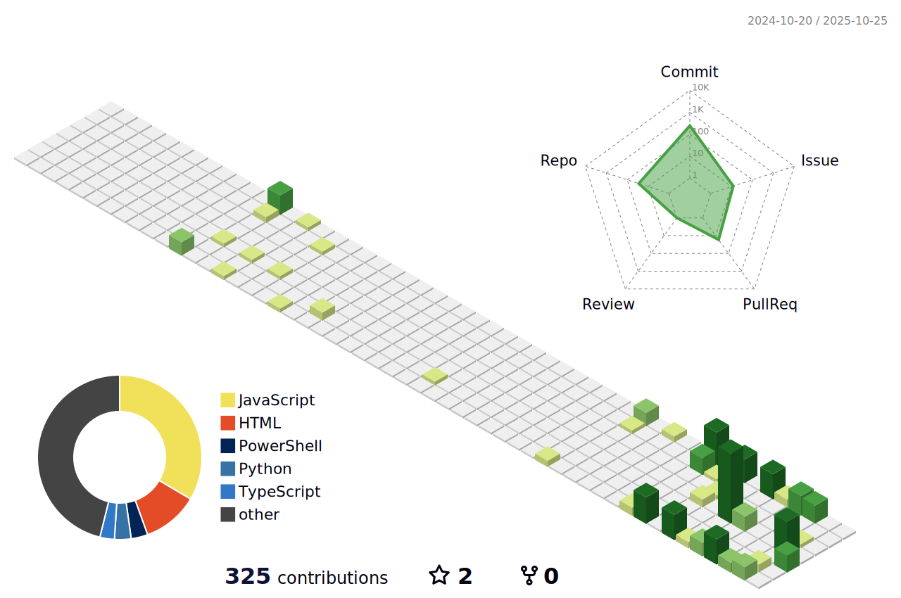

<p align="center">Welcome to my github profile!</p>
<h3 align="center">A passionate frontend and backend with some game knowledge developer from USA</h3>

## Coding Memes "May have required some good hummor stuff like words you put in a sentence that makes it spicy"


---

## Snake


---

## Portfolio
<p>https://portfolio-psi-lovat-84.vercel.app/</p>

---

## Leetcode Info
[](https://leetcode.com/tsmcidevtest)

---

## DevCard
<a href="https://app.daily.dev/crazybrad77"></a>

---

## My Commit Graph

---

## Some Stack OverFlow info
[](https://stackoverflow.com/users/31695967/brad-christopher)

---

## Here is some stuff like achivements:
<p align="left">  </p>

<p align="left"> <a href="https://github.com/ryo-ma/github-profile-trophy"></a> </p>

<p align="left"> <a href="https://twitter.com/b_incorp" target="blank"></a> </p>

---

## Waka Stuff

<!--START_SECTION:waka-->

```txt
Other        17 hrs 59 mins        ████████████████████████▒   97.19 %
TypeScript   19 mins               ▒░░░░░░░░░░░░░░░░░░░░░░░░   01.79 %
Markdown     8 mins                ▒░░░░░░░░░░░░░░░░░░░░░░░░   00.77 %
Bash         1 min                 ░░░░░░░░░░░░░░░░░░░░░░░░░   00.13 %
TSConfig     0 secs                ░░░░░░░░░░░░░░░░░░░░░░░░░   00.05 %
```

<!--END_SECTION:waka-->

---

## 🎧 Spotify – Recently Played


## 🎧 Spotify – Playing
[](https://github.com/kittinan/spotify-github-profile)

---

## 🎥 Featured Video
<!-- BEGIN YOUTUBE-CARDS -->
[](https://www.youtube.com/watch?v=64gfn-dfSMw)
[](https://www.youtube.com/watch?v=KeDhqapC84U)
[](https://www.youtube.com/shorts/khTQ2UFV6og)
[")](https://www.youtube.com/watch?v=KZiriiob7MA)
[")](https://www.youtube.com/watch?v=ffxOPuEPT0o)
[")](https://www.youtube.com/watch?v=c7ywGTrp5s0)
<!-- END YOUTUBE-CARDS -->

## Become my subscriber of the day
[](https://www.youtube.com/c/CrazyBrad77?sub_confirmation=1)

## 🌐 Connect With Me
<p align="left">
<a href="https://dev.to/crazybrad77" target="blank"></a>
<a href="https://twitter.com/b_incorp" target="blank"></a>
<a href="https://medium.com/@christopherbrad316" target="blank"></a>
<a href="https://www.youtube.com/c/youtube.com/@crazybrad77" target="blank"></a>
<a href="https://discord.gg/9jegSGnSYw" target="blank"></a>
</p>

---
## Chess Info

<!--START_SECTION:chessStats-->
<!-- Automatically generated with https://github.com/Balastrong/chess-stats-action -->

| Type | Rapid ⏲️ | Blitz ⚡ | Bullet 🔫 |
|:---:|:---:|:---:|:---:|
| Current | 100 | No Rating | 100 |
| Best | No Rating | No Rating | No Rating |

| White ⚪ | Black ⚫ | Result 🏆 | Date 📅 | Position 🗺️ | Type 🕕 |
|:---:|:---:|:---:|:---:|:---:|:---:|
| southplayer_82 | **CrazyBrad77** | timeout ❌ | 28/10/2025 | <a href="http://www.ee.unb.ca/cgi-bin/tervo/fen.pl?select=rnb2bnr/pp3ppp/3k4/1BpP1P2/4pB2/3P4/PPP3PP/RN2K1NR b KQ - 2 9">Link</a> | Bullet |
| charlesbanay | **CrazyBrad77** | timeout ❌ | 16/10/2025 | <a href="http://www.ee.unb.ca/cgi-bin/tervo/fen.pl?select=r1b2bnr/pP2ppp1/3k4/2p4p/8/N7/PP1PKPPP/R1BQ1BNR b - - 0 8">Link</a> | Bullet |
| CamiloML96 | **CrazyBrad77** | timeout ❌ | 23/5/2024 | <a href="http://www.ee.unb.ca/cgi-bin/tervo/fen.pl?select=rnbqkbnr/ppp1pppp/8/3p4/4P3/2N5/PPPP1PPP/R1BQKBNR b KQkq - 1 2">Link</a> | Daily |
| **CrazyBrad77** | ize_of_the_world | checkmated ❌ | 16/5/2024 | <a href="http://www.ee.unb.ca/cgi-bin/tervo/fen.pl?select=2k2bnr/pp3p1p/2np2p1/8/5r1K/2N4P/PPb3q1/R5NR w - -">Link</a> | Rapid |
| **CrazyBrad77** | jii-ni | checkmated ❌ | 15/5/2024 | <a href="http://www.ee.unb.ca/cgi-bin/tervo/fen.pl?select=8/5k1p/4b2p/8/5K1b/8/4q3/5r2 w - -">Link</a> | Rapid |
| sanjaysgowda | **CrazyBrad77** | checkmated ❌ | 15/5/2024 | <a href="http://www.ee.unb.ca/cgi-bin/tervo/fen.pl?select=8/8/8/3r2Q1/N2k1R2/3P4/PPP3PP/R1B1K3 b Q -">Link</a> | Rapid |

<!--END_SECTION:chessStats-->

---
## 📰 Latest Blog Posts
<!-- BLOG-POST-LIST:START -->
- [Making a Daily meme generator in html css and js!](https://dev.to/crazybrad77/making-a-daily-meme-generator-in-html-css-and-js-mgd)
- [first blog post i see](https://dev.to/crazybrad77/first-blog-post-i-see-cf7)
- [I am starting a blog as you did not know.](https://medium.com/@christopherbrad316/i-am-starting-a-blog-as-you-did-not-know-62a6f1574fbd?source=rss-0322de9eb776------2)
<!-- BLOG-POST-LIST:END -->
---

## 📊 GitHub Stats
<p align="center">
  
</p>
<p align="center">
  
</p> 
<p align="center">
  
</p>

## Things you need to know:

- 🔭 I’m currently working on [BradChat](https://github.com/TSMCIDevTest/BradChat)

- 👯 I’m looking to collaborate on **Any project that is possible for my brain.**

- 🤝 I’m looking for help with **Any project that is possible for my brain.**

- 👨‍💻 All of my projects are available at [https://github.com/TSMCIDevTest/TSMCIDevTest](https://github.com/TSMCIDevTest/TSMCIDevTest)

- 📝 I regularly write articles on [https://dev.to/crazybrad77](https://dev.to/crazybrad77)

- 📄 Know about my experiences [https://github.com/TSMCIDevTest/TSMCIDevTest](https://github.com/TSMCIDevTest/TSMCIDevTest)

- ⚡ Fun fact **I am very smart at coding!**


## Availblity
<p>I am availble weekdays 1pm to 9pm and weekends 7am to 9pm.</p>

## Links I use that are not blocked by high school
<p>VS Code: https://code.visualstudio.com/download</p>
<p>Google Earth Pro web or ios: https://www.google.com/earth/about/versions/</p>

## 💻 Languages & Tools
<p align="left"> <a href="https://developer.android.com" target="_blank" rel="noreferrer">  </a> <a href="https://appwrite.io" target="_blank" rel="noreferrer">  </a> <a href="https://www.arduino.cc/" target="_blank" rel="noreferrer">  </a> <a href="https://www.gnu.org/software/bash/" target="_blank" rel="noreferrer">  </a> <a href="https://www.blender.org/" target="_blank" rel="noreferrer">  </a> <a href="https://getbootstrap.com" target="_blank" rel="noreferrer">  </a> <a href="https://www.cprogramming.com/" target="_blank" rel="noreferrer">  </a> <a href="https://www.w3schools.com/cpp/" target="_blank" rel="noreferrer">  </a> <a href="https://www.w3schools.com/cs/" target="_blank" rel="noreferrer">  </a> <a href="https://www.w3schools.com/css/" target="_blank" rel="noreferrer">  </a> <a href="https://www.djangoproject.com/" target="_blank" rel="noreferrer">  </a> <a href="https://www.docker.com/" target="_blank" rel="noreferrer">  </a> <a href="https://www.electronjs.org" target="_blank" rel="noreferrer">  </a> <a href="https://expressjs.com" target="_blank" rel="noreferrer">  </a> <a href="https://www.figma.com/" target="_blank" rel="noreferrer">  </a> <a href="https://firebase.google.com/" target="_blank" rel="noreferrer">  </a> <a href="https://flask.palletsprojects.com/" target="_blank" rel="noreferrer">  </a> <a href="https://www.framer.com/" target="_blank" rel="noreferrer">  </a> <a href="https://cloud.google.com" target="_blank" rel="noreferrer">  </a> <a href="https://git-scm.com/" target="_blank" rel="noreferrer">  </a> <a href="https://golang.org" target="_blank" rel="noreferrer">  </a> <a href="https://heroku.com" target="_blank" rel="noreferrer">  </a> <a href="https://www.w3.org/html/" target="_blank" rel="noreferrer">  </a> <a href="https://www.java.com" target="_blank" rel="noreferrer">  </a> <a href="https://developer.mozilla.org/en-US/docs/Web/JavaScript" target="_blank" rel="noreferrer">  </a> <a href="https://jekyllrb.com/" target="_blank" rel="noreferrer">  </a> <a href="https://kubernetes.io" target="_blank" rel="noreferrer">  </a> <a href="https://laravel.com/" target="_blank" rel="noreferrer">  </a> <a href="https://www.linux.org/" target="_blank" rel="noreferrer">  </a> <a href="https://www.mongodb.com/" target="_blank" rel="noreferrer">  </a> <a href="https://www.mysql.com/" target="_blank" rel="noreferrer">  </a> <a href="https://nextjs.org/" target="_blank" rel="noreferrer">  </a> <a href="https://www.nginx.com" target="_blank" rel="noreferrer">  </a> <a href="https://nodejs.org" target="_blank" rel="noreferrer">  </a> <a href="https://www.oracle.com/" target="_blank" rel="noreferrer">  </a> <a href="https://www.php.net" target="_blank" rel="noreferrer">  </a> <a href="https://www.postgresql.org" target="_blank" rel="noreferrer">  </a> <a href="https://postman.com" target="_blank" rel="noreferrer">  </a> <a href="https://www.python.org" target="_blank" rel="noreferrer">  </a> <a href="https://reactjs.org/" target="_blank" rel="noreferrer">  </a> <a href="https://reactnative.dev/" target="_blank" rel="noreferrer">  </a> <a href="https://www.rust-lang.org" target="_blank" rel="noreferrer">  </a> <a href="https://www.sqlite.org/" target="_blank" rel="noreferrer">  </a> <a href="https://tailwindcss.com/" target="_blank" rel="noreferrer">  </a> <a href="https://www.typescriptlang.org/" target="_blank" rel="noreferrer">  </a> <a href="https://unity.com/" target="_blank" rel="noreferrer">  </a> <a href="https://unrealengine.com/" target="_blank" rel="noreferrer">  </a> </p>

## Final notes and me signing off of this readme
<p>Thanks for reading this and heres a challange find any closed non closed and welded words and orgnized it.</p>
<p>Bye all you guys and see you later!</p>
